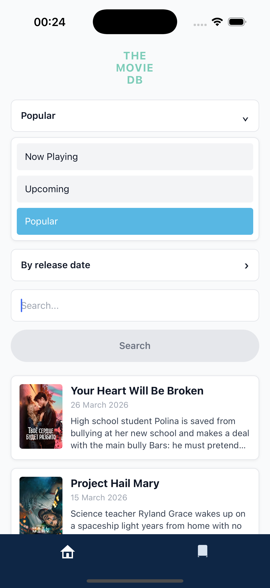
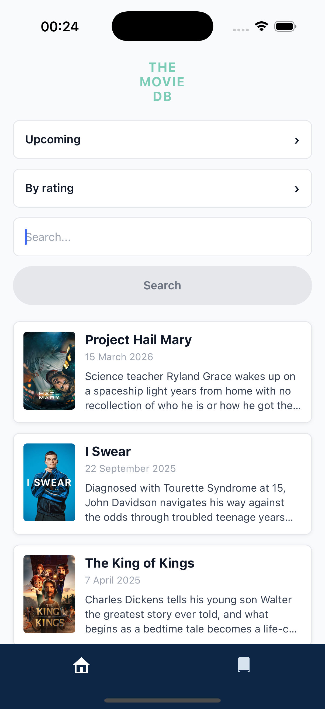
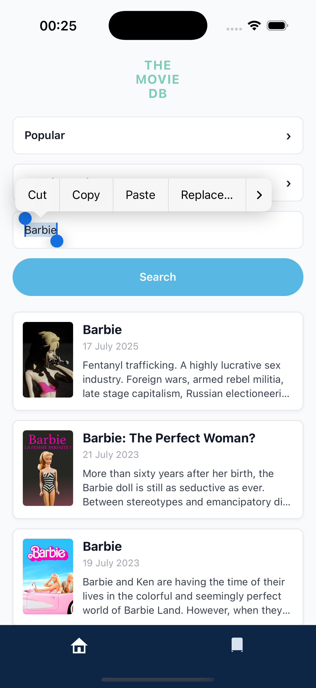
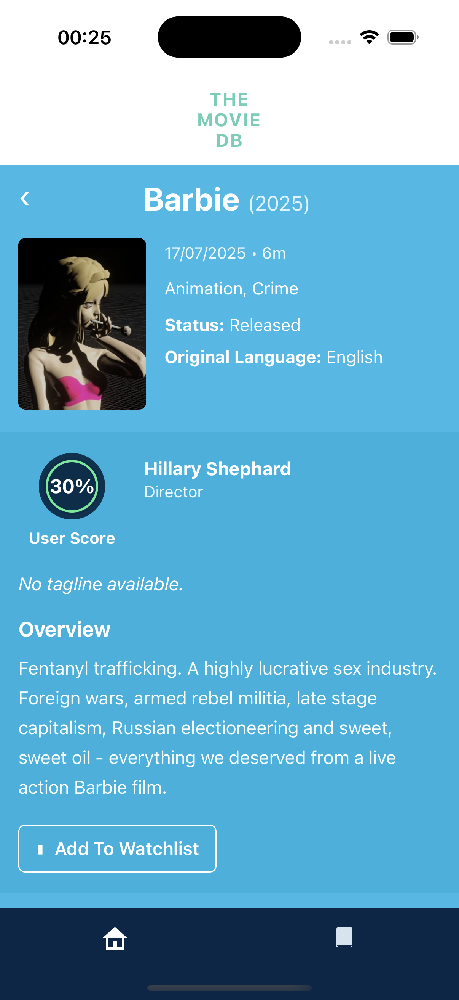
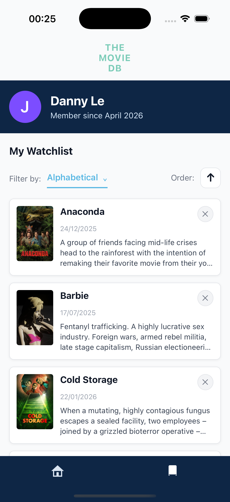
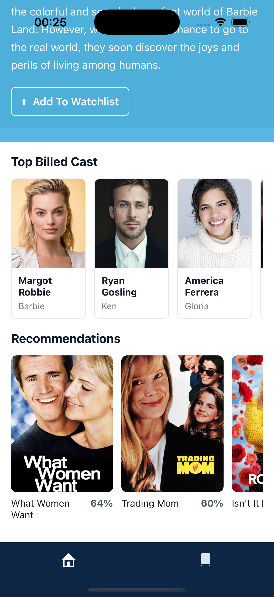
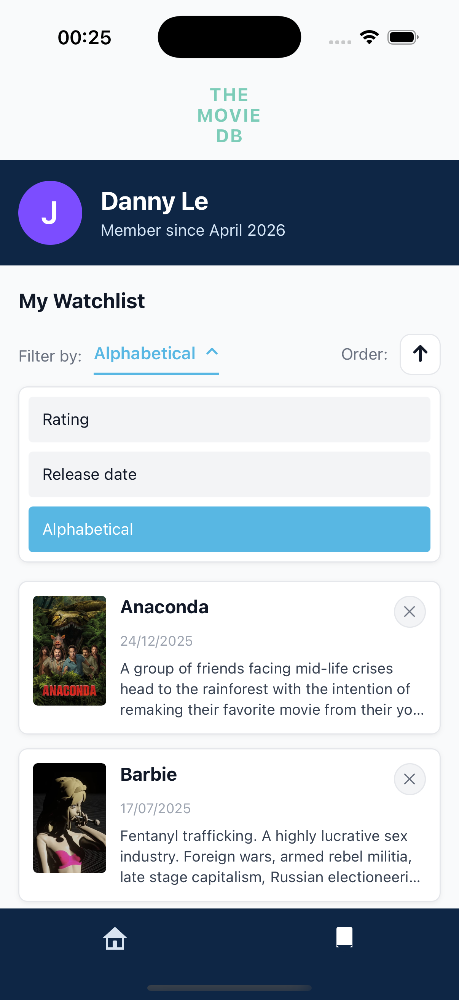
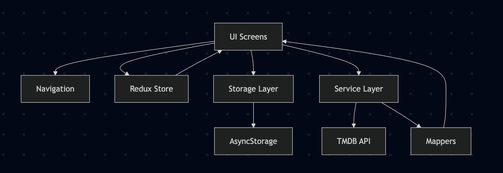

# MovieDb

A React Native take-home project built with TypeScript, Redux Toolkit, AsyncStorage, and TMDB API build by Danny.

## Screenshots

<p align="center">
  
  
  
  
  
  
  
</p>

This app lets users:

- browse movies by category
- search movies
- sort movie lists
- view movie details
- save movies to a watchlist
- revisit the watchlist later with persisted local storage

---

## Features

### Home

- Browse movies by category:
  - Now Playing
  - Upcoming
  - Popular
- Persist selected category in local storage
- Search movies using TMDB search endpoint
- Sort movies by:
  - alphabetical order
  - rating
  - release date
- Load more movies for category browsing
- Loading, empty, and error states

### Movie Details

- Movie poster
- Title and release year
- Release date
- Runtime
- Genres
- Status
- Original language
- User score
- Tagline
- Overview
- Director / Writer credits
- Top billed cast
- Recommendations
- Add / Remove Watchlist

### Watchlist

- Persisted watchlist using AsyncStorage
- Open saved movie details
- Remove movie from watchlist
- Local sort and order controls

---

## Tech Stack

- React Native
- TypeScript
- Redux Toolkit
- React Redux
- React Navigation
- AsyncStorage
- Axios
- TMDB API

---

## Architecture Overview

This project uses a simple layered structure with clear separation between UI, navigation, services, mapping, storage, and state.

### Architecture notes

- **UI layer** handles screen rendering and user interactions
- **Navigation layer** manages bottom tabs and nested stacks
- **Service layer** handles TMDB API requests
- **Mapper layer** transforms raw TMDB responses into UI-friendly models
- **Storage layer** handles local persistence with AsyncStorage
- **Store layer** handles global app state such as watchlist

### Why this structure

This keeps the UI decoupled from raw API response shapes and makes the code easier to scale, test, and maintain.

---

## Simple Architecture Diagram



components: reusable UI pieces
constants: route names, storage keys, sort/category constants
mappers: transforms API responses into UI models
navigation: tabs and nested stack navigators
screens: Home, Movie Details, Watchlist
services: TMDB API client and request functions
storage: AsyncStorage helpers
store: Redux slices, hooks, store config
types: shared TypeScript types
utils: formatting helpers

# Getting Started

> **Note**: Make sure you have completed the [Set Up Your Environment](https://reactnative.dev/docs/set-up-your-environment) guide before proceeding.
> Use this setup for local development:

Node.js: 18+
npm: 9+
Java: 17
Xcode: installed with iOS simulator
CocoaPods: installed and working
Android Studio: installed with Android SDK
Ruby: required for CocoaPods
Watchman: recommended on macOS

TMDB Setup

This project uses the TMDB Read Access Token.

Create the following file locally:

src/config/tmdb.ts

Add:

export const TMDB_READ_ACCESS_TOKEN = 'YOUR_TMDB_READ_ACCESS_TOKEN';

A sample file is included here:

src/config/tmdb.example.ts

## Step 1: Start Metro

First, you will need to run **Metro**, the JavaScript build tool for React Native.

To start the Metro dev server, run the following command from the root of your React Native project:

```sh
# Using npm
npm start

# OR using Yarn
yarn start
```

## Step 2: Build and run your app

With Metro running, open a new terminal window/pane from the root of your React Native project, and use one of the following commands to build and run your Android or iOS app:

### Android

```sh
# Using npm
npm run android

# OR using Yarn
yarn android
```

### iOS

For iOS, remember to install CocoaPods dependencies (this only needs to be run on first clone or after updating native deps).

The first time you create a new project, run the Ruby bundler to install CocoaPods itself:

```sh
bundle install
```

Then, and every time you update your native dependencies, run:

```sh
bundle exec pod install
```

For more information, please visit [CocoaPods Getting Started guide](https://guides.cocoapods.org/using/getting-started.html).

```sh
# Using npm
npm run ios

# OR using Yarn
yarn ios
```

If everything is set up correctly, you should see your new app running in the Android Emulator, iOS Simulator, or your connected device.

This is one way to run your app — you can also build it directly from Android Studio or Xcode.

## Congratulations! :tada:

You've successfully run and modified your Movie DB App. :partying_face:

# Troubleshooting

If you're having issues getting the above steps to work, see the [Troubleshooting](https://reactnative.dev/docs/troubleshooting) page.
